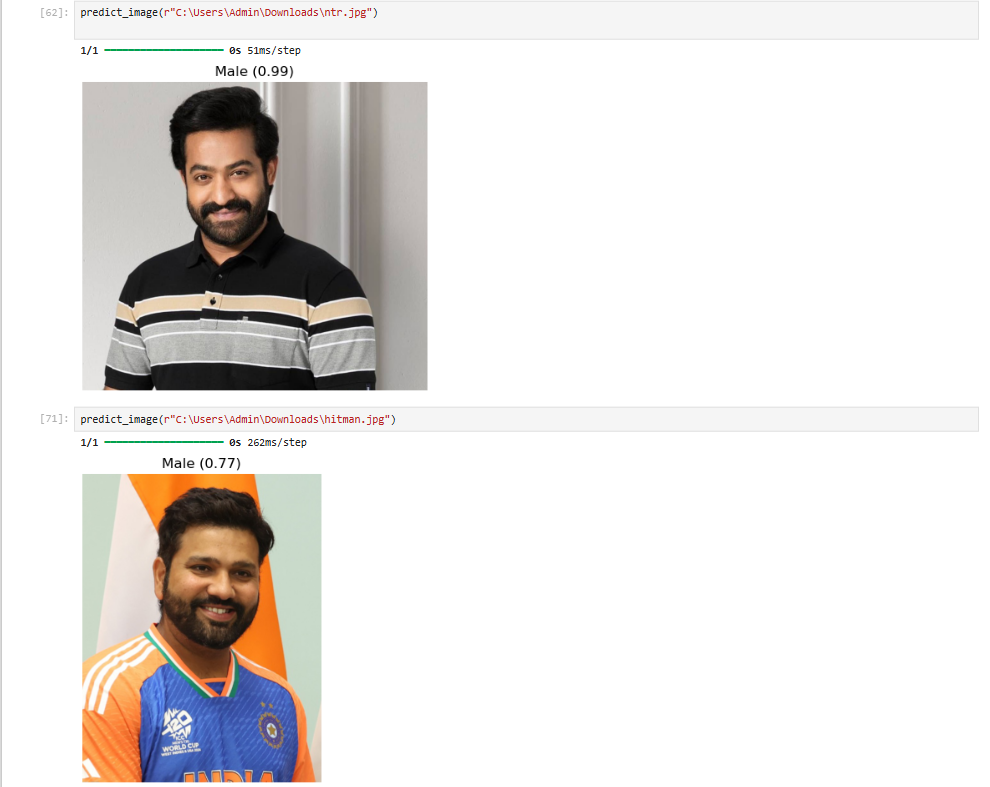
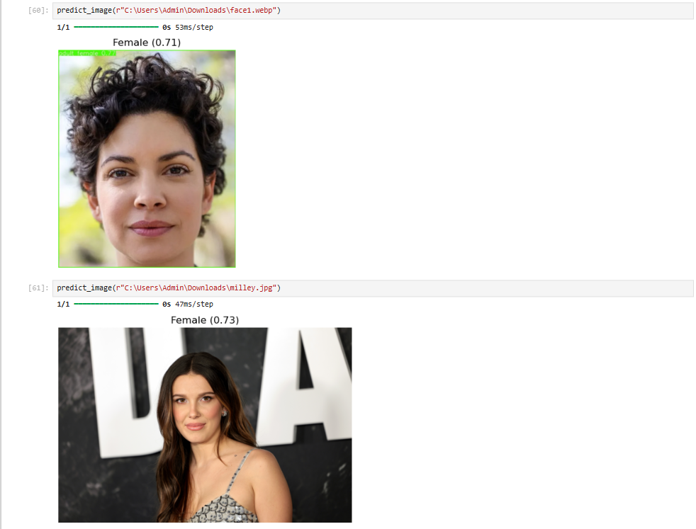

# 🧠 Gender Classification using CNN


This project implements a **Convolutional Neural Network (CNN)** to classify gender from facial images using the UTKFace dataset.

---

## 📌 Project Overview

The goal of this project is to build a deep learning model that can:

- Predict gender (Male/Female) from an image  
- Handle image preprocessing  
- Evaluate model performance  
- Demonstrate predictions on real images  

---

## 🗂 Dataset

- **Dataset Used:** UTKFace Dataset  
- Contains images labeled with:
  - Age  
  - Gender  
  - Ethnicity  

### Gender Labels:
- `0 → Male`  
- `1 → Female`  

---

## ⚙️ Technologies Used

- Python  
- TensorFlow / Keras  
- NumPy  
- PIL  
- Matplotlib  
- Scikit-learn  

---

## 🏗 Model Architecture

- Conv2D (32 filters) + BatchNormalization + MaxPooling  
- Conv2D (64 filters) + BatchNormalization + MaxPooling  
- Conv2D (128 filters) + BatchNormalization + MaxPooling  
- Conv2D (256 filters) + BatchNormalization + MaxPooling  
- Dense (128)  
- Dropout  
- Dense (64)  
- Output Layer (Sigmoid)

---

## 🚀 Training Details

- Image size: **96 × 96**
- Dataset size: ~8000 images  
- Optimizer: Adam  
- Loss: Binary Crossentropy  
- Epochs: 8–10  
- Batch Size: 32  

---

## 📊 Model Performance

- Accuracy: **~85–88%**
- Evaluation:
  - Classification Report  
  - Confusion Matrix  

---

## 🔍 Prediction Demo

```python
def predict_image(path):
    original = Image.open(path).convert("RGB")

    img = original.resize((96, 96))
    img = np.array(img) / 255.0
    img = np.expand_dims(img, axis=0)

    pred = model.predict(img)[0][0]

    if pred < 0.35:
        gender = "Male"
    elif pred > 0.55:
        gender = "Female"
    else:
        gender = "Uncertain"

    confidence = pred if pred > 0.5 else 1 - pred

    plt.imshow(original)
    plt.axis("off")
    plt.title(f"{gender} ({confidence:.2f})")
    plt.show()
```

## 📸 Results & Predictions

### 🔹 Sample Prediction 1


- Model Prediction: Female  
- Confidence: ~0.71  
- Observation: Clear frontal face, good lighting → correct prediction  

---

### 🔹 Sample Prediction 2


- Model Prediction: Female  
- Confidence: ~0.73  
- Observation: Works well on high-quality images  

---

### 🔹 Key Insight

- Model performs well on:
  - Frontal faces  
  - Good lighting  

- Model struggles with:
  - Background noise  
  - Non-frontal angles  
